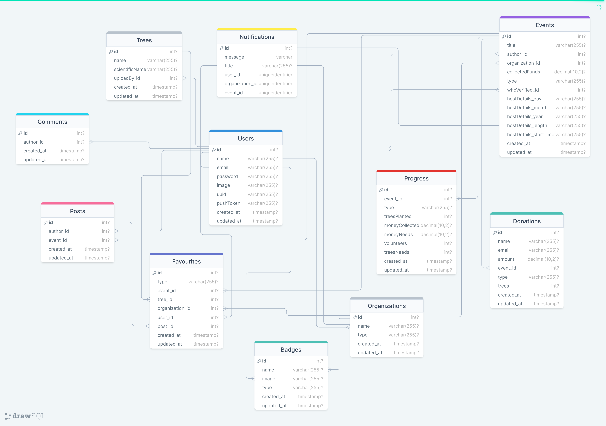

---


---
To see it on YouTube click below

[](https://www.youtube.com/watch?v=AXVCvDrNtbo&ab_channel=ALOMGIR)


# PlantifyUs Project Report

## Introduction

PlantifyUs is an Android application designed to cater to the needs of plant enthusiasts who wish to explore, learn, and share information about various plant species. This application serves as a platform for connecting plant lovers, facilitating the discovery of plant information, and promoting a sense of community among users. PlantifyUs aims to provide an intuitive and user-friendly interface for users to discover, interact with, and contribute to a comprehensive plant database.

## Features 

### 1. Plant Discovery and Information
Users can explore an extensive collection of plant species, including detailed information such as names, categories, characteristics, and benefits. The app's search functionality enables users to find specific plants based on their names, categories, or unique characteristics.

### 2. Personalized Accounts
PlantifyUs allows users to create accounts, enabling them to personalize their plant collections and actively participate in the community. Users can add plants to their favorites for quick access and contribute their plant photos and descriptions to expand the application's plant database.

### 3. Community Interaction
The application promotes community interaction by allowing users to connect with fellow plant enthusiasts. Users can engage in discussions, share comments, and exchange insights about plants and plant care.

### 4. Plant Care Recommendations
PlantifyUs provides personalized plant care recommendations based on users' plant collections and preferences. This feature assists users in maintaining healthy and thriving plants.


Certainly! Here's a brief overview of the functional requirements of the PlantifyUs project:

### Functional Requirements

1. **User Authentication and Registration:**
   - Users can create accounts and log in using their email and password.
   - User registration requires valid email addresses and secure passwords.
   - Users can reset their passwords if forgotten.

2. **Plant Discovery and Information:**
   - Users can search for plant species by name, category, or characteristics.
   - Detailed information about each plant includes names, categories, characteristics, and benefits.
   
3. **Personalized User Profiles:**
   - Users can personalize their profiles with a profile picture and a brief bio.
   - Profiles display users' collections, favorited plants, and badges.

4. **Adding Plants to Collection and Favorites:**
   - Users can add plants to their personalized collections.
   - Users can mark plants as favorites for quick access.

5. **Community Interaction:**
   - Users can comment on plants, events, and other users' contributions.
   - Discussions and interactions are facilitated through comment sections.

6. **Contributing Plant Information:**
   - Users can contribute plant photos and descriptions to expand the plant database.
   - Contributed plant information is subject to approval by administrators.

7. **Plant Care Recommendations:**
   - Users receive personalized plant care recommendations based on their collections and preferences.
   - Recommendations help users maintain the health of their plants.

8. **Event Management:**
   - Users can create, manage, and join plant-related events.
   - Event details include titles, descriptions, dates, locations, and requirements.

9. **Organization Profiles:**
   - Organizations can create profiles to represent plant-related groups or initiatives.
   - Profiles display organization details, events, and contributions.

10. **Payment Processing:**
   - Users can make payments for events, donations, or premium features using the integrated Stripe payment platform.

11. **Badge System:**
    - Users can earn badges based on their contributions, activity, and achievements.
    - Badges provide recognition and incentives for user engagement.

12. **Notifications:**
    - Users receive notifications for activities such as comments, event updates, and badge achievements.
    - Notifications enhance user engagement and keep users informed.

13. **User Roles and Permissions:**
    - Users have different roles, including user, moderator, and administrator, each with varying permissions.
    - Moderators and administrators have additional privileges for content management and user interactions.

These functional requirements outline the core features and capabilities of the PlantifyUs Android application, providing users with a comprehensive and engaging plant-related experience.

## Technologies Used

PlantifyUs is built using a combination of technologies and libraries:

- **React Native:** A powerful framework for developing native mobile applications using JavaScript and React.
- **Expo:** A set of tools and services that simplifies the development, building, and deployment of React Native applications.
- **Firebase:** A backend platform used for user authentication and data storage, contributing to the application's user management and content storage.
- **Redux:** A state management library that efficiently manages the application's state and interactions.
- **React Navigation:** A navigation library that enables smooth and intuitive navigation between different screens within the app.
- **Axios:** A library used for making HTTP requests to retrieve plant data and interact with APIs.
- **Stripe:** A payment processing platform integrated into the app for handling transactions.
- **Lottie:** A library for displaying and animating JSON-based animations.

## Installation and Usage

1. Clone the repository:
   ```sh
   git clone https://github.com/your-username/PlantifyUs.git
   ```
2. Navigate to the project directory:
   ```sh
   cd PlantifyUs
   ```
3. Install dependencies using npm or yarn:
   ```sh
   npm install
   ```
   or
   ```sh
   yarn install
   ```
4. Start the Metro bundler:
   ```sh
   npm start
   ```
   or
   ```sh
   yarn start
   ```
5. Connect your Android device or emulator.
6. Run the application on Android:
   - For physical devices:
     ```sh
     npm run android
     ```
     or
     ```sh
     yarn android
     ```
   - For emulators:
     ```sh
     npm run android
     ```
     or
     ```sh
     yarn android
     ```

Note: Ensure that you have the correctly configured with the backend server. You can find the backend configuration API URL in the `index.js` file.
which is located in the `src/constants/index.js` directory. You can also find the backend configuration API URL in the `index.js` file.
   
   replace the `API_URL` with your own backend API URL.
   ```sh
       const API_URL = "http://your-backend-api-url/api";
       const API_URL = "http://192.168.0.112:5000/api"; // example
   ```

Note: Ensure that you have the latest version of Node.js installed on your system. You can download Node.js from the [official website](https://nodejs.org/en/download/).


## Database Design

PlantifyUs's database design is based on an SQL-like schema, featuring tables such as Users, Organizations, Events, Trees, Donations, Posts, Favourites, Notifications, Badges, Progress, and Comments. These tables define various relationships, including one-to-many and many-to-many relationships through junction tables.

## Contribution

Contributions to the project are encouraged. If you encounter any issues or have suggestions for improvements, please open an issue or submit a pull request. Before contributing, ensure you review the project's contributing guidelines.

## Conclusion

PlantifyUs provides a rich and engaging experience for plant enthusiasts, enabling them to explore and share their passion for plants. With its user-friendly interface, comprehensive plant database, and community interaction features, PlantifyUs offers a valuable resource for plant lovers of all levels of expertise.

For inquiries and support, feel free to contact the project maintainer, Alomgir, at a.h.joy066@gmail.com.

Visit the [PlantifyUs website](https://www.plantifyus.com) for more information and support.

Happy planting! 🌿

---

This report briefly highlights the key aspects of the PlantifyUs Android application project, including its features, technologies used, installation, database design, and conclusion. You can include additional details and customize the report further to meet the specific requirements of your project submission.

For more information about the PlantifyUs project, visit the [PlantifyUs website](https://www.plantifyus.com).
